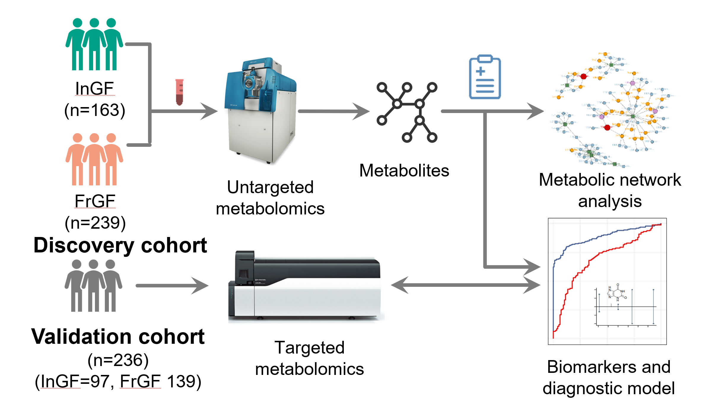
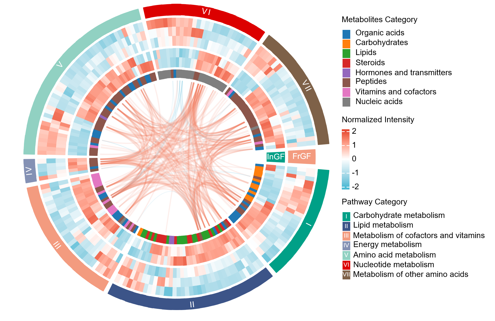
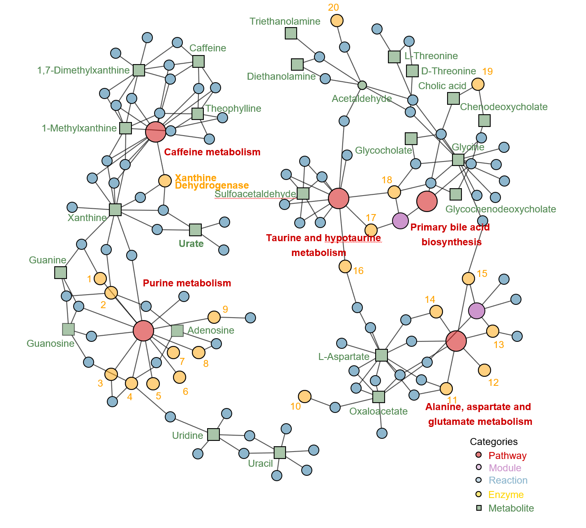
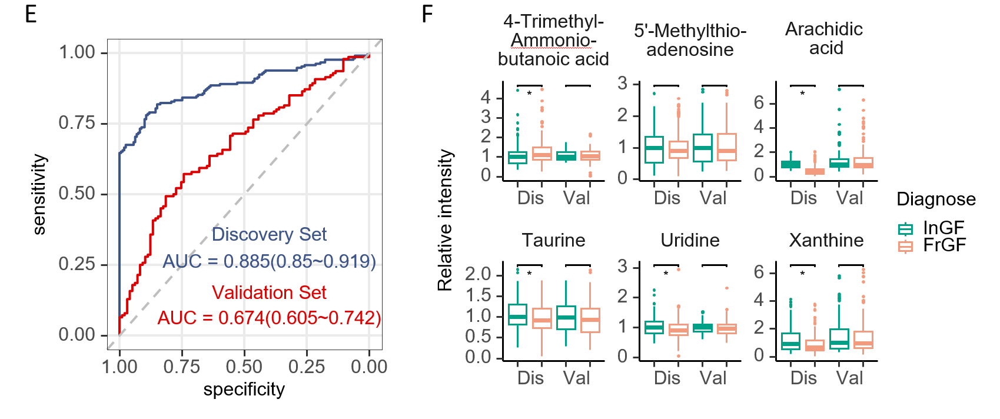

---
date: "2025-03-16"
image:
  caption: Studydesing
  focal_point: Smart
summary: Metabolomics and Machine Learning Identify Metabolic Differences and Potential Biomarkers for Frequent versus Infrequent Gout Flares
tags:
- Biomarkers
title:  Gout Biomarkers
--- 

To discover differential metabolites and pathways underlying infrequent gout flares (InGF) and frequent gout flares (FrGF) using metabolomics and establish a predictive model by machine learning (ML) algorithms.

Serum samples from a discovery cohort with 163 InGF and 239 FrGF patients were analyzed by mass spectrometry-based untargeted metabolomics to profile differential metabolites and explore dysregulated metabolic pathways using pathway enrichment analysis and network propagation-based algorithms. ML algorithms were performed to establish a predictive model based on selected metabolites, which was further optimized by a quantitative targeted metabolomics method and validated in an independent validation cohort with 97 participants with InGF and 139 participants with FrGF.

Differential metabolites between InGF and FrGF groups were identified. 
Top dysregulated pathways included carbohydrates, amino acids, bile acids, and nucleotide metabolism. 

Subnetworks with maximum disturbances in the global metabolic networks featured cross-talk between purine metabolism and 
caffeine metabolism, as well as interactions among pathways involving primary bile acid biosynthesis, 
taurine and hypotaurine metabolism, alanine, aspartate and glutamate metabolism, suggesting epigenetic
modifications and gut microbiome in metabolic alterations underlying InGF and FrGF. 

Potential metabolite biomarkers were identified using ML-based multivariable selection and further 
validated by targeted metabolomics. Area under receiver operating characteristics curve for 
differentiating InGF and FrGF achieved 0.88 and 0.67 for the discovery and validation cohorts, respectively.

In summary, Systematic metabolic alterations underlie InGF and FrGF, and distinct profiles are associated with differences in gout flare frequencies. Predictive modeling based on selected metabolites from metabolomics can differentiate InGF and FrGF.
