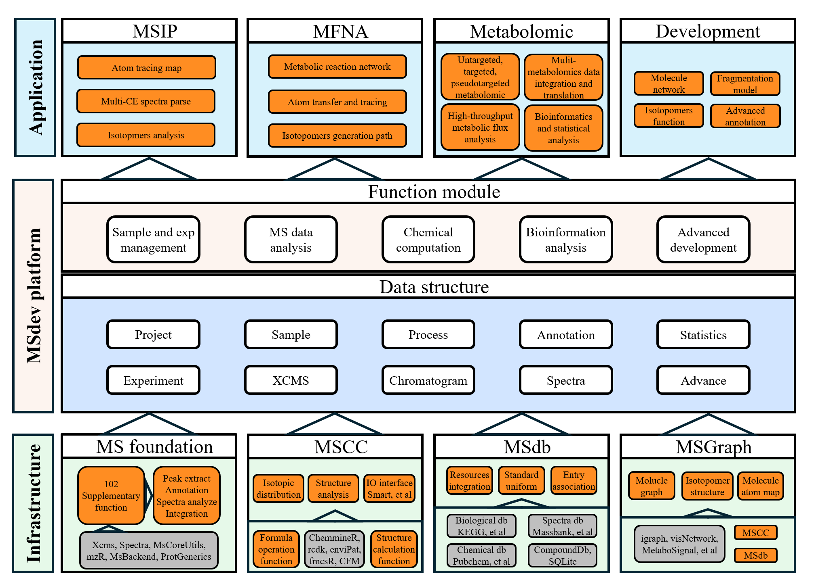

The lack of a universal analytical platform is one of the key factors 
limiting the biological application and development of metabolomics methodologies. 
We developed a metabolomics data analysis and method development platform, MSdev. 
MSdev integrates and develops various core tools and databases, including mass spectrometry 
data analysis, chemical computations, metabolomics databases, and molecular graph structures. 
This platform not only facilitates our routine metabolomics and metabolic flux analysis but also supports the development of advanced methods such as MSIP and MFNA.

