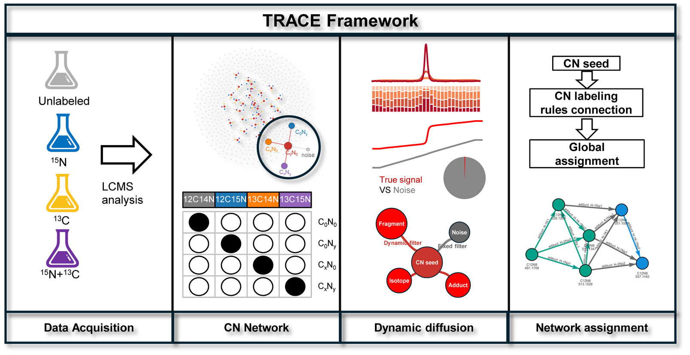
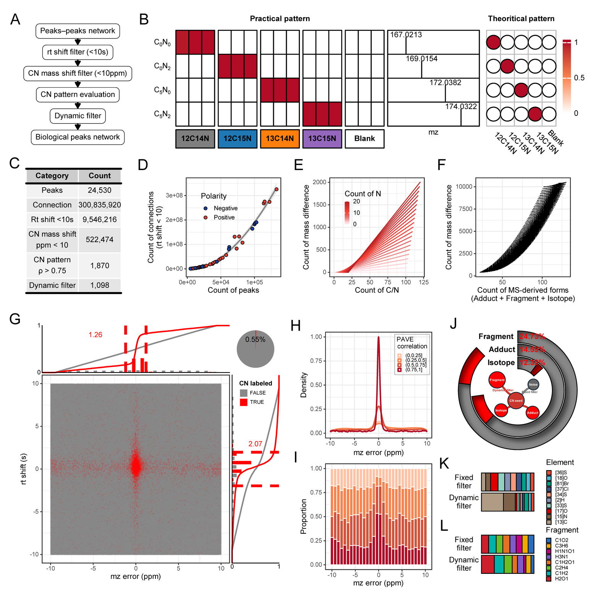
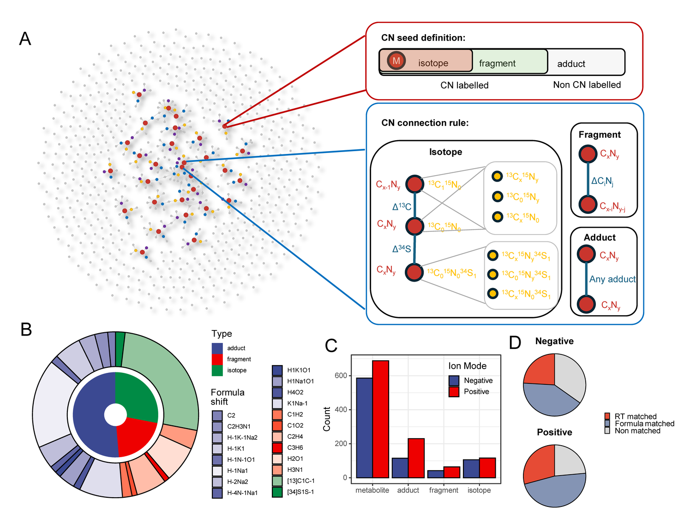
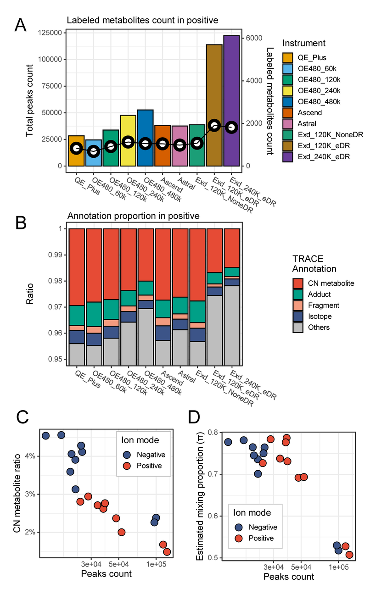
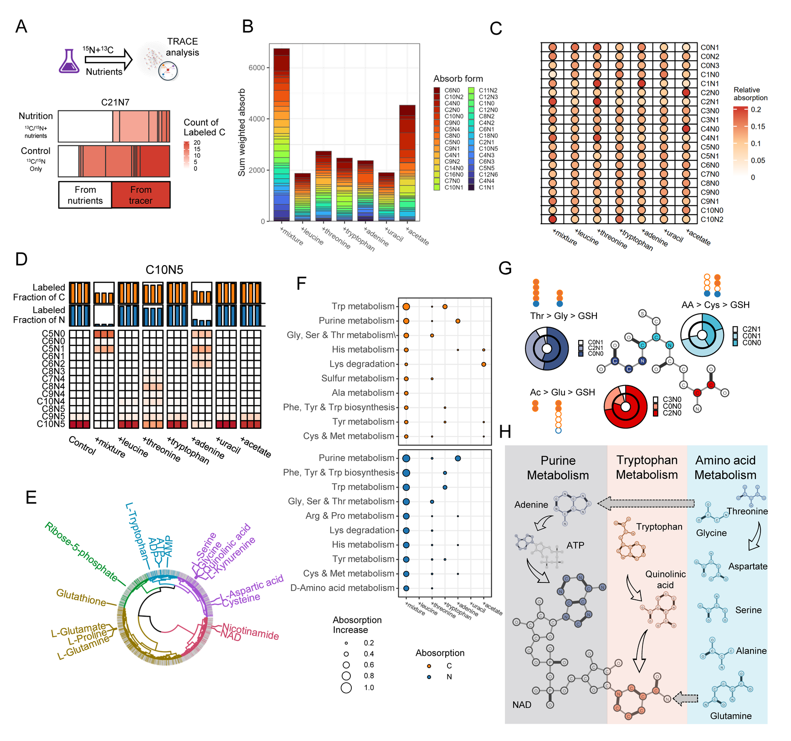

TRACE is an integrated experimental–computational framework for untargeted LC–MS metabolomics. It uses complete <sup>13</sup>C/<sup>15</sup>N labeling to validate biological metabolites, then maps how competing unlabeled nutrients enter metabolism by **isotopic dilution** rather than label enrichment.

The work is published in *Analytical Chemistry* ([doi:10.1021/acs.analchem.6c02292](https://doi.org/10.1021/acs.analchem.6c02292)). Software documentation is at [drruili.github.io/TRACE](https://drruili.github.io/TRACE/). TRACE runs on [MSdev](/project/msdev/) objects and xcms peak tables.

## Why TRACE

Untargeted LC–MS can survey microbial metabolism at scale, but two problems remain tightly coupled:

1. **Which peaks are biological?** Modern instruments report tens of thousands of features. Many are adducts, in-source fragments, or chemical contaminants rather than metabolites made by the cell.
2. **Which nutrients are used when several are present?** Classical isotope tracing follows one labeled substrate at a time. It does not ask how cells choose among competing carbon and nitrogen sources.

Existing tools, including our earlier single-peak method PAVE, validate features in isolation. Fixed *m/z* and retention-time tolerances then generate large numbers of false connections as sensitivity increases, and they struggle to group the many MS forms of one metabolite.

TRACE addresses both problems with one design: fully label cells with <sup>13</sup>C-glucose and <sup>15</sup>N-ammonium, treat isotope-confirmed peaks as network seeds, calibrate error tolerances from those seeds, then map unlabeled nutrient fate by isotopic dilution.

## Experimental design

*Saccharomyces cerevisiae* CEN.PK was grown for more than ten generations in minimal medium with [U-<sup>13</sup>C<sub>6</sub>]-glucose and [U-<sup>15</sup>N<sub>2</sub>]-(NH<sub>4</sub>)<sub>2</sub>SO<sub>4</sub> as the sole carbon and nitrogen sources, so *de novo* metabolites carry predictable CN mass shifts.

Four tracer groups define the seeds:

| Sample | Label | Role |
|--------|-------|------|
| Unlabeled | C0N0 | Light carbon and nitrogen |
| <sup>15</sup>N-ammonium | C0Ny | Light carbon, heavy nitrogen |
| <sup>13</sup>C-glucose | CxN0 | Heavy carbon, light nitrogen |
| Dual label | CxNy | Heavy carbon and nitrogen |

For nutrient competition, unlabeled supplements (leucine, threonine, tryptophan, adenine, uracil, acetate, or a 14-compound mixture) were added on this labeled background. Incorporation of an unlabeled nutrient **dilutes** the <sup>13</sup>C/<sup>15</sup>N labeling of downstream metabolites.


*Figure 1. TRACE workflow. Isotope-confirmed peaks seed a network of adduct, fragment, and isotope connections; dynamic m/z and RT tolerances are learned from true CN links.*

## From seeds to a calibrated network

TRACE first keeps coeluting peak pairs whose *m/z* differences match theoretical <sup>13</sup>C/<sup>15</sup>N shifts, then requires a complete unlabeled / <sup>15</sup>N / <sup>13</sup>C / dual-label **CN bundle** whose intensities match the expected 1:1:1:1 pattern (Pearson ρ > 0.75).

In a representative positive-mode data set this collapsed ~25,000 features and hundreds of millions of pairs to **1,098** high-confidence bundles. True CN links cluster tightly around zero *m/z* error and RT shift. TRACE fits that cluster as a Gaussian signal against a nonparametric background and uses the central 99% of the signal as **dynamic tolerances**, then propagates adduct, fragment, and isotope edges only inside those bounds.


*Figure 2. Network construction and dynamic filtering. High-ρ CN bundles define data-driven m/z and RT tolerances that suppress implausible isotopes and rare fragment forms.*

## Global assignment and annotation

Edges are typed as isotope, fragment, or adduct and scored as chemical transformations (for example [M+H]<sup>+</sup> → [M+Na]<sup>+</sup> is H<sub>−1</sub>Na<sub>1</sub>). TRACE then partitions seeds into compatible subnetworks so that one metabolite and its MS forms share a seed, instead of resolving conflicting pairwise assignments.

Against an authentic-standard library, TRACE removed PAVE hits with large *m/z* or RT error, corrected adduct mis-assignments caused by pairwise conflicts, and recovered features that PAVE had missed. About 70% of TRACE-annotated peaks matched HMDB, YMDB, KEGG, or an in-house database; about 27% of candidates matched in-house RT standards.


*Figure 3. Network assignment. TRACE groups adducts, fragments, and isotopologues of one metabolite and annotates a representative seed.*

## More sensitivity is not more biology

The same labeled yeast extract was analyzed on four Orbitrap platforms (Q Exactive Plus, Exploris 480, Astral, Excedion Pro) and at several resolutions. Total features rose by **331%** from QE Plus to Excedion Pro, while TRACE-validated metabolites rose only **117%**. The share of high-confidence biological annotations fell from **2.94% to 1.48%**. Extra peaks are mostly non-biological unless annotation is specific.


*Figure 4. Instrument comparison. Feature count grows faster than TRACE-validated metabolites as sensitivity and resolution increase.*

## Nutrient fate under competition

With formulas and CN networks fixed from the four tracer groups, TRACE maps nutrient conditions onto that network. For each metabolite, the **labeling fraction** is the abundance-weighted <sup>13</sup>C or <sup>15</sup>N atom count; the **absorption fraction** is the drop in labeling relative to the fully labeled control.

The complete mixture contributed carbon and nitrogen across sulfur, purine, and amino-acid metabolism. Individual supplements were pathway-selective: tryptophan into tryptophan metabolism, adenine into purine metabolism, threonine into serine/glycine metabolism, acetate as C<sub>2</sub>/C<sub>4</sub>/C<sub>6</sub> units.

Two molecules test the method at opposite extremes of pathway architecture:

- **Glutathione (GSH)** is a linear tripeptide. Its isotopologues tracked glutamate, glycine, and cysteine, including acetate-derived carbon in the glutamate moiety and threonine-derived C<sub>2</sub>N<sub>1</sub> in glycine.
- **NAD<sup>+</sup>** is a hub (adenine + two riboses + nicotinamide). Unlabeled adenine produced both salvage (C<sub>5</sub>N<sub>0</sub>) and ongoing *de novo* (C<sub>10</sub>N<sub>5</sub>) forms; unlabeled tryptophan diluted nicotinamide via kynurenine; a C<sub>0</sub>N<sub>1</sub> nicotinamide form indicated glutamine nitrogen entering independently of the carbon backbone.


*Figure 5. Nutrient-source attribution. Isotopic dilution maps competing unlabeled nutrients into pathways; GSH and NAD⁺ illustrate linear assembly versus convergent biosynthesis.*

## Software

A typical analysis loads a pre-processed MSdev object (xcms peaks with `sample.type` set to the four isotope groups), runs the pipeline, and exports tables:

```r
library(MSdev)
library(TRACE)

obj <- TRACE_workflow(
  obj,
  rt.tol = 10,
  ppm = 5,
  cpdb = "path/to/trace.cp.db.xlsx"
)

TRACE_export(obj, file = "TRACE_results.xlsx")
```

| Version | Role |
|---------|------|
| [`v1.0.0`](https://github.com/DrRuiLi/TRACE/releases/tag/v1.0.0) | Code used for the published article |
| `main` (1.1.0+) | Ongoing development |

Install the article snapshot with `devtools::install_github("DrRuiLi/TRACE", ref = "v1.0.0")`. See [Get started](https://drruili.github.io/TRACE/articles/TRACE.html) for the full workflow.

## Scope

TRACE is built for systems in which complete isotopic labeling (the 1:1:1:1 CN bundle) is achievable, as in yeast grown for many generations on labeled glucose and ammonium. It is not a drop-in seed detector for mammalian cells. High-confidence TRACE annotations can still be transferred by running mammalian samples in the same batch as fully labeled microbial references and aligning features.
